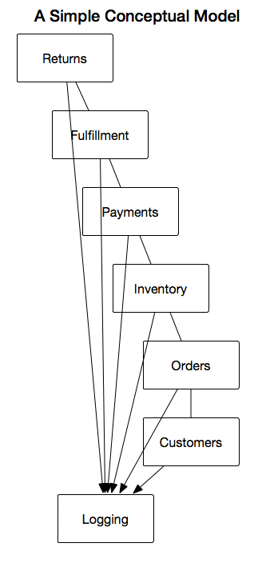

# CrowdCrunch Microservices Example

Bryan Cantrill first made the observation that the modern microservice movement closely mimics the Unix philosophy. For those who have forgotten the Unix philosophy, it is three simple rules...

1. Write small tools that do one thing and do it well.
2. Write tools that work together.
3. Write tools that communicate using text streams, because that is a universal interface.

Rather than text streams, which are a bit dated, we're using JSON over HTTPS but the principle of small components being interconnected is not new. I would recommend checking out some of [Bryan Cantrill's talks](http://dtrace.org/blogs/bmc/2018/02/03/talks/) because they are very entertaining and they'll give you some great historical perspective on what is happening in computing today.

Wouldn't it be nice if there were a query language that let us describe the shape of our desired JSON response and returned exactly the data we need? Yes, and that's exactly what GraphQL provides. Our philosophy then becomes...

1. Write small services that do one thing and do it well.
2. Write services that work together.
3. Write services that communicate using GraphQL.

How do we solve real problems using this approach? Let's consider the relatively standard set of business problems solved by projects such as [OFBiz](https://ofbiz.apache.org/) and [Magento](https://magento.com/). How can we address these problems in our brave new cloud native world?

There are a lot of moving parts here in a seemingly simple example! This 
seemingly fractal complexity can be a little bit overwhelming, but let's walk
through this problem and find out what we can learn here. 

I initially wanted to use the most recent Istio 1.0 snapshot but I think it is 
more prudent here to use the 0.8 LTS release and work with a stable foundation.
Istio 1.0 is going to be A Big Deal(TM), but let's see what we can do today.

## A Simple Concept Meets Reality

Let's consider a very simple conceptual model of this. A customer places orders from inventory, this results in payments which result in fulfillments and possibly returns. Everything is logged. Simple enough, right? Let's try to model this and consider the way data would actually flow through the system.

The problem here is that this model isn't accurate at all. Payments refer to orders which are the predicate of fulfillments. Returns refer to both orders and payments which means that payments flow bidirectionally. What's more, this diagram doesn't even consider the underlying architecture. To a software developer, the diagram above is basically meaningless.

## Development Environment

I'm going to assume a MacOS X 10.13 environment with Homebrew installed. This 
also requires XCode to be installed, but the full setup of this environement is 
beyond my scope here. The Docker for Mac edge release includes Kubernetes, and 
we can easily destroy our local cluster and recreate it if needed. Very nice!

    brew install stern # For easily viewing logs
    brew install siege # For load testing components
    brew install kubernetes-helm
    brew install kubernetes-cli
    brew install git
    brew install wget
    brew install gettext
    brew link --force gettext # needed to envsubst

It's reasonably safe to have a newer version of the `kubectl` command than your server version. These should align more precisely in the near future.

## Building The Kubernetes Substrate

### Getting Started

Let's begin by making a directory to contain our work here.

    mkdir k8s

### Helm

Helm Charts make it fairly easy to describe and install complex Kubernetes deployments and it is an official Kubernetes project now, so we'll be using 
Helm in this application. Helm and Kubernetes suffer from a very uncommon 
issue: at times, it feels too easy. Here is [a great article](https://developer.epages.com/blog/tech-stories/kubernetes-deployments-with-helm) that walks through the design of Helm and describes how we're going to be using it in this context. The tl;dr version is that Helm takes a lot of guesswork out of deploying applications to Kubernetes and it's worth learning.

### Istio

Istio is, in a word, awesome. The service mesh is a vital component of a modern 
microservice stack and Istio is rapidly becoming the de facto standard. A 
great many problems are solved out of the box, leaving us to focus on our own 
problems. It just so happens that the problem here, the service mesh, is hugely 
impactful and crucial to implementing a distributed system and managing the 
interaction between services. Imagine if you had to write an operating system 
each time you wanted to build a new program! Although not quite as dramatic, 
that situation would be very similar to the one faced by authors of distributed 
systems until fairly recently.

With the imminent 1.0 release of Istio, we should be able to install Istio with 
Homebrew and Helm, consolidating this a bit. For now, we'll manually download 
the 0.8 release snapshot and install it with `helm`.

    wget https://github.com/istio/istio/releases/download/0.8.0/istio-0.8.0-osx.tar.gz
    tar -xzf istio-0.8.0-osx.tar.gz
    cd istio-0.8.0
    # Initialize a service account for Tiller
    kubectl apply -f install/kubernetes/helm/helm-service-account.yaml
    # Intall Tiller on your cluster with the service account.
    # We won't worry about securing Tiller for now!
    helm init --service-account tiller
    # Install CoreDNS. This comes out of the box in K8S 1.11
    helm install --name coredns --namespace=kube-system stable/coredns
    # Install Istio with tracing, Grafana, and Prometheus
    helm install install/kubernetes/helm/istio --name istio --namespace istio-system \
    --set tracing.enabled=true \
    --set tracing.jaeger.enabled=true \
    --set prometheus.enabled=true \
    --set grafana.enabled=true \
    --set global.mtls.enabled=true \
    --set global.controlPlaneSecurityEnabled=true

As Helm works its magic, we can watch the progress!

    kubectl get pods -n istio-system

In only a few lines, we've done quite a bit. Particularly noteworthy is that 
TLS is enabled both in the control plane and between service instances. We also 
have automatic sidecar container injection, so we don't really have to think 
about Envoy as application developers. This is pretty nice.

Let's investigate a bit.

    alex@amnesiac ~/crowdcrunch $ kubectl get pods -n istio-system
    NAME                                       READY     STATUS      RESTARTS   AGE
    grafana-6f6dff9986-pdmrc                   1/1       Running     0          1m
    istio-citadel-7bdc7775c7-2fd46             1/1       Running     0          1m
    istio-egressgateway-78dd788b6d-lxx64       1/1       Running     0          1m
    istio-ingress-98c5cdf88-nlffx              1/1       Running     0          1m
    istio-ingressgateway-7dd84b68d6-tthmf      1/1       Running     0          1m
    istio-mixer-post-install-65kxn             0/1       Completed   0          1m
    istio-pilot-d5bbc5c59-5trvf                2/2       Running     0          1m
    istio-policy-64595c6fff-wcnxq              2/2       Running     0          1m
    istio-sidecar-injector-645c89bc64-qkn82    1/1       Running     0          1m
    istio-statsd-prom-bridge-949999c4c-vcsdh   1/1       Running     0          1m
    istio-telemetry-cfb674b6c-ll8z2            2/2       Running     0          1m
    istio-tracing-754cdfd695-mwrqn             1/1       Running     0          1m
    prometheus-86cb6dd77c-7vhw6                1/1       Running     0          1m

Off to the races!

There are still many caveats to production deployment, but we're getting there.

### Observability with Kiali and Jaeger

Kiali is cool. I mean, it's really cool. With Kiali, we can visualize and 
understand the relationship between the services in our application as it 
runs. The great thing about this is that it is not specific to any one 
application or service toplogy; it can be used to visualize anything that is 
running atop an Istio service mesh. The possibilities are endless and the 
project is still young, but I think it is very exciting.

    curl https://raw.githubusercontent.com/kiali/kiali/v0.5.0/deploy/kubernetes/kiali-configmap.yaml | \
    VERSION_LABEL=master envsubst | kubectl create -n istio-system -f -

    curl https://raw.githubusercontent.com/kiali/kiali/v0.5.0/deploy/kubernetes/kiali-secrets.yaml | \
    VERSION_LABEL=master envsubst | kubectl create -n istio-system -f -

    curl https://raw.githubusercontent.com/kiali/kiali/v0.5.0/deploy/kubernetes/kiali.yaml | \
    IMAGE_NAME=kiali/kiali \
    IMAGE_VERSION=v0.5.0 \
    NAMESPACE=istio-system \
    VERSION_LABEL=master \
    VERBOSE_MODE=4 envsubst | kubectl create -n istio-system -f -

We're in business. Let's make Kiali accessible now...

     kubectl -n istio-system port-forward $(kubectl -n istio-system get pod -l app=kiali -o jsonpath='{.items[0].metadata.name}') 3000:20001
     open http://localhost:3000 # In a seperate shell

You can login with username and password, "admin"

I recommend using `tmux` or `screen` so you can easily keep a few sessions 
going at once without running kubectl in the background for port forwarding.

Kiali is not only useful for runtime analysis. As we'll see here, it is also 
very useful tool for application design and development. The architecture 
design mockups are going to closely match what Kiali shows us in a live system, 
providing us a clear path from conception to actualization.

Kiali will be supported out of the box with Istio 1.0!

### Monitoring with Prometheus and Grafana

Kiali provides insight into the service mesh and the way that traffic is 
flowing through it but sometimes we also want specific insights into our own 
application according to metrics and dashboards that we define. This is where 
Promethus and Grafana become invaluable, allowing us to get a very complete 
picture of how our application is behaving in realtime.

    kubectl -n istio-system port-forward $(kubectl -n istio-system get pod -l app=grafana -o jsonpath='{.items[0].metadata.name}') 3000:3000
    open http://localhost:3000 # In a seperate shell

## Writing Our Application 

We'll be using Node 10.x to mock up our microservices and present them to the 
world with [GraphQL stitching](https://codeburst.io/nodejs-graphql-micro-services-using-remote-stitching-7540030a0753). This is actually as cool as it sounds! One great 
thing about this approach is that it is language agnostic, so you can choose a 
different programming language if it is more well suited to a particular 
service. One current drawback of this approach is that there isn't a good 
solution for GraphQL Subscriptions but I'm confident that solutions will emerge 
soon.

At a glance, you can see that this repository is itself a Helm chart. 
Deployment and rolling upgrades are a fundamental part of the design here!

## Chaos Engineering

Coming soon! We'll introduce failures to our system and see how it responds.

## Preparing for Production

In a real application, we'll want a multi master Kubernetes installation...